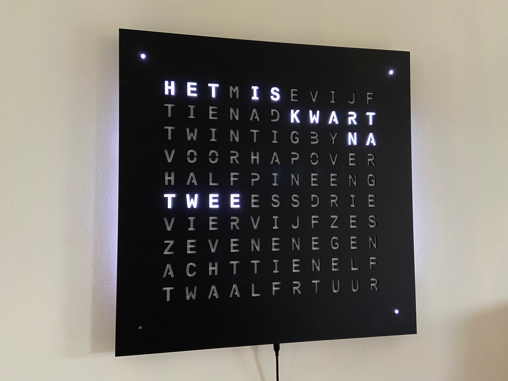
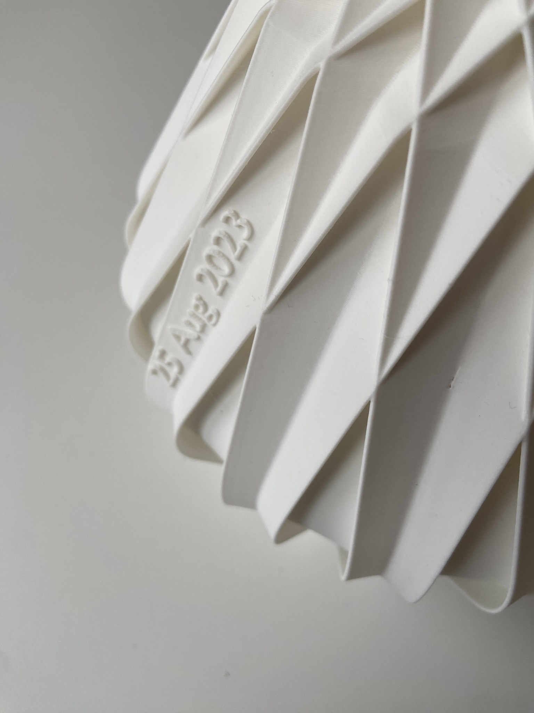
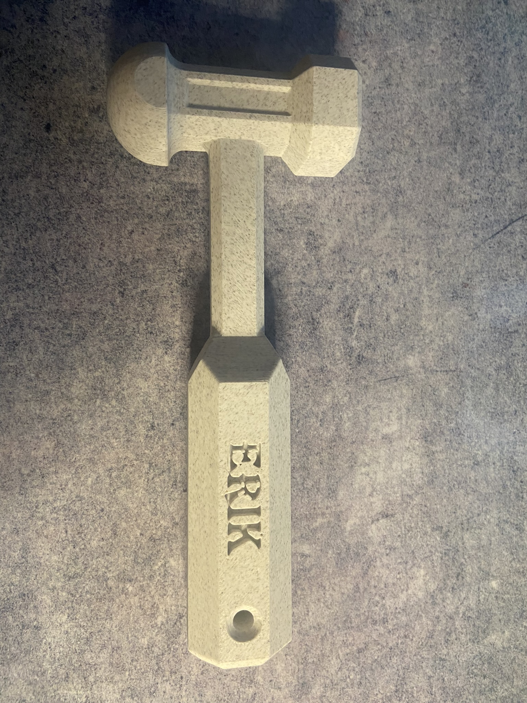
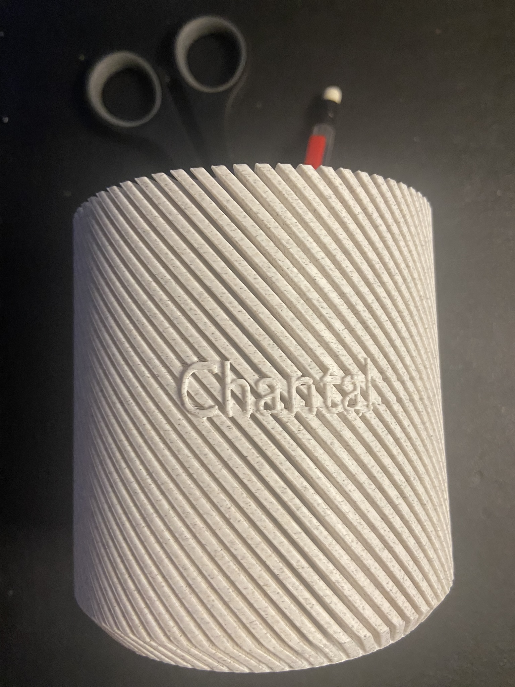

# 3D art ... personalized

| <h1>Word Clock | |
| - | - |
|  | The [clock](http://neowordclock.be/) is where it all started. The clock itself is based on the [QLOCKTWO](https://qlocktwo.com/) clock, but the middle of the clock can be customized to display your (company's) name.      `Please do not replace HAPPINESS without a very good reason`     Please contact us for a design proposal. |
| <h1>Zuzanna lamp</h1> |
| This was the next project, a remake of [lefabshop](https://www.thingiverse.com/lefabshop/designs)'s [Zuzanna](https://www.thingiverse.com/thing:730263) lamp.     `A special object as a wedding gift.`  |  | 
| <h1> THWACK </h1> ||
|  | A very useful tool in the lab, the [THWACK](https://www.thingiverse.com/thing:34404) hammer.     `Lucky Erik`    Now completely customizable.  | 
| <h1> Pencil Cup </h1> ||
| This one is for all the assistants.     A personalized pencil cup     Happy `ADMINISTRATIVE PROFESSIONALS DAY` Chantal |  |

